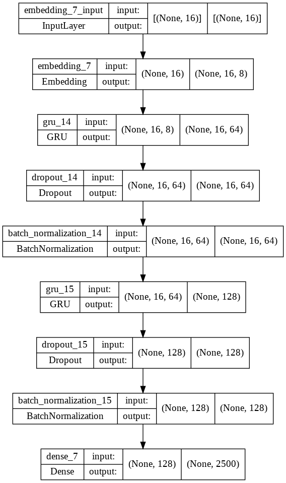

# Generate Eurobeat lyrics with a word-level RNN model

**Author:** Eemil Ahonen, eeonaaah@student.jyu.fi

## Prerequisites

- Python 3.6+
- [Pandas 1.3.5](https://pandas.pydata.org/)
- [NumPy 1.19.5](https://numpy.org/)
- [Tensorflow 2.7.0](https://github.com/tensorflow/tensorflow)
- (Optional) [Wordcloud 1.5.0](https://github.com/amueller/word_cloud) (for the word cloud)
- (Optional) [Beautiful soup 4.10.0](https://www.crummy.com/software/BeautifulSoup/) (for data scraping)


## Introduction
In this project, we generate song lyrics for the music genre Eurobeat.

Eurobeat is a dance music genre that originated in Italy. Until the modern 
streaming age, Eurobeat was written and produced in Italy and only sold in 
Japan. The CD compilation series [Super Eurobeat](https://en.wikipedia.org/wiki/Super_Eurobeat) 
is one of the longest-running music compilations in the world.

The music genre is known for its crazy lyrics, which makes sense knowing that 
the Italians writing it had little to no fluency in the English language. The 
generation of lyrics will be interesting since the lyrics contain a plethora of 
grammar mistakes.


## Gathering data
We scrape the data from a Eurobeat discussion forum [Eurobeat Prime](https://eurobeat-prime.com). 
The website keeps a database of lyrics found in Eurobeat songs. The lyrics were 
submitted by community members, so there is variation between the structures of 
different lyrics.

The lyrics database has lyric pages with data on artists, titles, and lyrics. 
The website reliably lists lyric pages according to the first letter of the 
artists' name. We use these listing pages to find every lyric page URL. We write
these listing pages to a [listing_urls.txt](./data/listing_urls.txt) file.

Next, we loop through these listing pages to save every lyric page URL listed. 
We select these lyric page URLs with a CSS attribute selector 
`a[href^=\?lyrics]`. We write these URLs to a [lyric_urls.txt](./data/lyric_urls.txt) file.
Notebook for this: [scrape_eurobeat_lyric_urls.ipynb](./scrape_eurobeat_lyric_urls.ipynb)

After finding the lyric page URLs, we use them to scrape the data. We find the 
artist, title, and lyrics from the `<div>` element with a `mmids` class. We 
write these to a [lyric_dataset.csv](./data/lyric_dataset.csv) file. 
Notebook for this: [scrape_eurobeat_lyrics.ipynb](./scrape_eurobeat_lyrics.ipynb)

Most of the pages follow a convention of **Artist - Title** to separate the two. 
Since a few pages break this convention, we have to fix these entries by hand.


## Methods
We use a word-level RNN language model to generate the text. We choose a 
word-level language model instead of a character-level one since the available 
computing power and data are small. Word-level language models have the 
advantage of showing higher accuracy with lower computational costs on smaller 
datasets. However, on larger datasets, character-level models perform better 
with the added benefit of a smaller vocabulary and syntax preservation.

The amount of existing word-based models is small, and almost every language 
model tutorial is about character-based language models.

We generate text by giving the model a sequence of 16 words, and the generator 
generates the next suitable word. We use stochasticity in the sampling process 
to add variety to the output of the generator. For more information, see e.g. 
cap. 12.1.3 in [Chollet's DL book](https://livebook.manning.com/book/deep-learning-with-python-second-edition/chapter-12/section-12-1-3?origin=product-preview-toc).


### Cleaning the data
To clean the dataset, we filter out the special characters and empty lines. 
Next, we replace the linebreaks with a custom `<br>` token. After that, we 
create a tokenizer and convert every word to its dictionary counterpart. 

To reduce data variety, we limit the vocabulary size to 2500 and remove every 
entry with more than `MAX_OOV_TOKENS` amount of words out of the dictionary. 
The lower variety and size of the dataset lead to better validation accuracy and
lower computational cost. However, we want the generated text to have variety 
and originality, so we leave this value at two.


### Creating the training data
We generate the training data by looping through every entry in the cleaned 
dataset. We take every sequence of 16 words as the training sequence and the 
next word as the label. Step size indicates the distance between samples. We use
a step size of one.


### Model
For the model, we use an embedding layer and two GRU layers, followed by a 
dropout and batch normalization. After the last batch normalization, we use a 
dense layer with a softmax activation function. The softmax output layer gives 
us the probability vector of the next word. Choosing the model is a long and
iterative process.

We use batch normalization to standardize the inputs to the layers, which speeds
up training. Other input normalization techniques exist, but we choose batch 
normalization since it shows the best effect. 
[Read more on input normalization in recurrent networks](https://arxiv.org/pdf/1607.06450.pdf)

The model with and without batch normalization:


We choose the sizes of the GRU layers and dropouts by testing different values. 
Since the vocabulary is small, we find the best results with eight embedding 
dimensions. We choose the activation function "tanh" for the GRU layers. "relu" 
shows a better validation accuracy and lower validation loss, but NVIDIAs cuDNN 
GRU implementation doesn't support any other activation function than "tanh".

GRUs with tanh-activation and ReLU-activation:


Model architecture:


We use an AMSGrad optimizer with a learning rate of 0.0004 and a categorical 
crossentropy loss function.


### Optimization
We optimize the dropout layers and kernel initializers of the model manually to 
find the model with the most stable learning curve. We use grid search to find 
the best values for the learning rate, batch size, and GRU layer sizes.
Notebook for grid search: [2_eurobeat_rnn_word_prediction_grid_search.ipynb](./2_eurobeat_rnn_word_prediction_grid_search.ipynb).

Graphs of the grid search: [grid_search_graphs.pdf](./output/grid_search_graphs.pdf) 
and the configurations: [grid_search_configurations.txt](./output/grid_search_configurations.txt).

We save the model with the best validation accuracy using `ModelCheckpoint` 
callback.


## Results

### Model performance
Manual evaluation of generated text is accurate but labor-intensive. Different 
methods exist for automatically evaluating generated text.
[Read more on evaluating natural language generation](https://ai.googleblog.com/2020/05/evaluating-natural-language-generation.html)

The trained model reaches a validation accuracy of 0.3204 Which is low but 
expected. The model is slightly overfitting. However, the model creates original 
and creative phrases such as *Cause I get higher from your confusion*, 
*Can I excite you now*, and *Never surrender for your love*.

The sentences created by the generator make sense most of the time. Some of the 
sentences even rhyme with the previous one, which is impressive.

In [3_eurobeat_rnn_word_prediction_diagnostics.ipynb](./3_eurobeat_rnn_word_prediction_diagnostics.ipynb) 
we analyze the model performance on evaluate data. 
The evaluation accuracy is 30.56. The model seems to overfit words such as I, 
`<br>`, the, you, be, me, and wanna. The model underfits on words such as and, 
your, my, <OOV>, all, just, and I'm. The most confident, accurate predictions 
seem to be for the words "of" and `<br>`. Similarly, the most confident 
incorrect predictions are for the words "of" and `<br>`.

In [4_eurobeat_rnn_word_final_predictions_and_generator.ipynb](./4_eurobeat_rnn_word_final_predictions_and_generator.ipynb) 
we find the results are similar with unseen data. The accuracy is 30.53. The 
most overfitting and underfitting words remain the same.


### Experimentation
We found the best validation accuracy by splitting the lyrics into the same 
length sentences and generating new ones, but this removes most of the dataset 
and variety on generated sentences.

We tried concatenating the lyric entries to generate more training samples by 
using parts of the earlier lyric entry to predict parts of the next. This does 
work, but the variance in the generated samples goes up since the context might 
change between the two entries.

Using LSTMs instead of GRUs does increase training time but doesn't improve 
accuracy. This could change with an increase in the length of the input 
sequence.

Using a bidirectional recurrent neural network did not improve the performance.

The model outputs valid text even with a seed text made of just letters. If the 
seed text doesn't contain any words in the dictionary, it just converts them to 
`<OOV>` tokens and generates normal text.
Testing the model with a temperature of 1 and a seed of 
"a a a a a a a a a a a a a a a a ":
```
night you can make it all this love
do you look at me
cant you feel it
and i remember you care about me
whatever you cant do
```

The model outputs more grammatically correct than a smaller model trained for 
fewer epochs. The smaller model also shows a lower validation accuracy.
Testing the model with GRU layer sizes divided by 4, trained for only one 
epoch. 
Seed string from Other Side of Night — Odyssey Eurobeat (Not in the dataset):
"I found the rest of me in what I thought was fantasy\nWith the last of doubt I can freely shout "
```
shame
i am the way nothings nite goes speed making the fire
i wanna wanna never wont be free
lie come of used
just deeper a obsession lazy happiness
senses you wherever
samurai precious of right
same about desire
onto arms away around you ah now
hot until once on than your days yes deeper
```

### Further development
Possible further development would be changing the size of the input sequence 
to keep more context of the previous words.

Testing different models and sizes or increasing the training data could 
increase the low validation accuracy of the model.


### Generated samples
Seed string from Other Side of Night — Odyssey Eurobeat (Not in the dataset):
"I found the rest of me in what I thought was fantasy\nWith the last of doubt I can freely shout "

#### Temperature: 0.5
```
i wanna feel you baby i need you
baby baby take me to the top
i wanna stay with you
every night and day
i know you can be mine
i need you now
i want to be your girl
dont you feel me
dont let me down
love is your game
you
```


#### Temperature: 1.0
```
the world
i see your fire were ready just keep so right
yeah playing the night
let the music fall in love
dont let me go
we gonna be happy side
drive you tonight
and i try to keep on your destination
you can discover baby baby love you
how can pass on now for
```


#### Temperature: 1.5
```
up
lay your body working
strange amp passion
eternally cos heat bang oooh funny
ya change the heart im magic desire ill do you ground
golden baby games and getting ready
tell your hand could ? a shining lady
shout believe love turn fire dont closer now
ill keep in the groove running with your save
```


#### Temperature: 2.0
```
bang been but now hey really much care together with me sweet passion
u take by deep into in i will fill all lonely satisfaction in feeling without desire
doesnt battle around cure precious only rocket deep shining danger lady
faraway see when becomes never set the sun and a while its all it behind all the until lie for tomorrow
```
